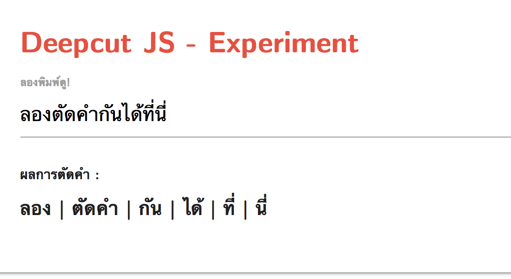

# DeepcutJS (experiment version)




This is a folder for `DeepcutJS` demo available on [rkcosmos.github.io/deepcut/](https://rkcosmos.github.io/deepcut/).
We use [`keras-js`](https://github.com/transcranial/keras-js) to run the demo.

The model is trained using a truncated version of full `deepcut` model. Therefore,
the web-version might not give the full accuracy as the model in Python. After training the model,
we can save and binarize the model using [`encoder.py`](https://github.com/transcranial/keras-js/blob/master/python/encoder.py).

```bash
model.save('model_lite.h5')
./encoder.py -q /path/to/model_lite.h5 # to get model_lite.bin
```

To run the demo locally, you can use `http.server` from Python.

```bash
python -m http.server 8000 # Python 3
python -m SimpleHTTPServer 8000 # Python 2
```

The demo can be accessed at `http://localhost:8000/`
